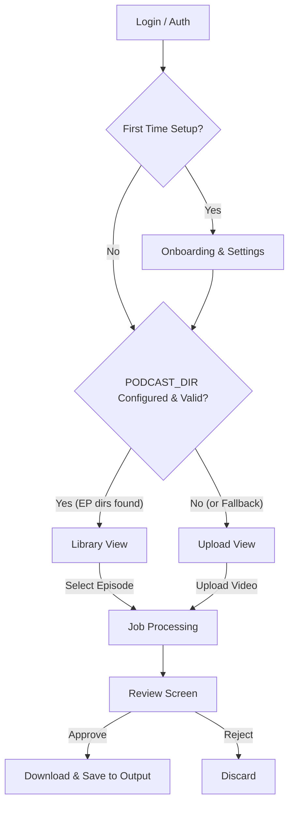

# Celia Clips - Dashboard Design Spec

## Overview
This document outlines the UX flow and UI design for the Celia Clips Dashboard (MVP). The dashboard provides a self-hosted, single-user interface for independent podcasters to process raw episodes into viral clips.

## Target Audience & Context
- **Primary User:** Independent podcaster or solo creator.
- **Environment:** Self-hosted (local machine), single-tenant (no multi-user roles for MVP).
- **Core Goal:** Minimize friction in converting long-form videos into curated short clips ready for social media.

## Architecture & Data Flow

## User Flows

### 1. Onboarding (First-time Experience)
- Connect Google account (Auth).
- Set default preferences (watermark, minimum clip duration).
- **Directory Setup:** Explain the recommended folder structure (`PODCAST_DIR`/`EP001_Title`/`video.mp4`). If the user links a directory, the app uses the Library Flow.

### 2. Main Dashboard (Adaptive)
The dashboard adapts based on the user's setup:
- **Library-First (Preferred):** Displays episodes found in `PODCAST_DIR` as cards. Episodes > 5 mins are shown here. Clips (< 5 mins) or files in `output/` are filtered out.
- **Upload-First (Fallback):** A clean drag-and-drop interface for users who prefer processing one-off files without a structured directory.

### 3. Review Screen
Once an episode is processed (or while evaluating past jobs):
- Shows the generated clips (typically 5-8 per episode).
- **Actions:** 
  - Play preview.
  - Approve (✅).
  - Reject (❌).
- **Post-Approval:** Approved clips are saved to the organized `output/` folder and offered for immediate manual download (.mp4). Direct social publishing is deferred to v2.

## UI/Aesthetic Guidelines

**Theme:** Dark Mode Glassmorphism (Consistent with Landing Page).

- **Layout Structure:**
  - **Sidebar (Left):** Vertical, icon-based navigation (Home, Library, Settings, etc.).
  - **Header:** Personalized greeting ("Hi, [Name]!"), search bar (for episodes), and main CTA.
  - **Content Area:** Grid system for cards and widgets with generous spacing and soft borders.

- **Visual Language:**
  - Background: Deep slate dark (`#020617` / Slate 950) with subtle noise overlay and grid patterns.
  - Surfaces: Glass panels (`rgba(255, 255, 255, 0.02)` with `backdrop-filter: blur(24px)`) and 1px subtle borders.
  - Accents: Celia Brand Green (`#3e8e63` to `#c4ebd8`).
  - Typography: `Plus Jakarta Sans` for UI/body, `JetBrains Mono` for code/stats.

- **Interactions:**
  - Smooth hover states elevating the glass cards (`transform: translateY(-2px)`, enhanced shadow).
  - Clear, distinct focus rings for accessibility.
  - Use of `cursor-pointer` on all interactive elements.

## Component Breakdown & Missing Elements (MVP)

To fulfill the requirements outlined in the architecture Phase 4, the dashboard will include the following components:

## Component Breakdown & Missing Elements (MVP)

To fulfill the requirements outlined in the architecture Phase 4 and align with the backend API models (`server/models.py`), the dashboard will include the following components:

1. **Auth UI (`components/auth/`)**:
   - Google OAuth logic and Login screen.
   - Fallback: Local simple entry if self-hosted without Supabase Auth.
   
2. **Dashboard Layout**:
   - **SidebarNav:** Links to Home (Upload), Library, Settings, Analytics.
   - **DashboardHeader:** Greeting, contextual search (filters episodes), user avatar.
   - **Toast Notifications:** Global system for success/error alerts (`react-hot-toast` or similar).

3. **Core Workflow Views**:
   - **UploadZone:** Form mapping to `ProcessRequest` model:
     - Target Duration: Min (default 30) - Max (default 90)
     - Minimum Virality Score (default 70)
     - Subtitle Style (highlight, etc.)
     - Transcription Source (local_whisper, etc.)
   - **Library View (Episodes):** Maps to `EpisodeResponse`. Grid of cards showing:
     - Episode Number & Title
     - Status badges: Has Video, Has Transcript, **Is Processed**
     - Action: "Process Episode" button
   - **ProcessingStatusWidget:** Real-time feedback via WebSocket for active jobs, showing state (`pending`, `processing`, `completed`) and percent progress.
   - **ClipReviewList (`components/review/`):** Maps to `Clip` model. Grid showing for each clip:
     - Video player (HTML5)
     - Metadata: Virality Score, Title, Summary, Start/End times, Category.
     - Action buttons: Approve (✅), Reject (❌), Download (⬇️).

4. **Settings & Configurations (`routes/settings.py` frontend equivalent)**:
   - Form mapping to `UpdateSettingsRequest` / `SettingsResponse`:
     - **Core Paths:** `podcast_name`, `podcast_dir`
     - **API Keys (Masked):** `groq_api_key`, `supabase_url`, `supabase_key`
   - **Feature Toggles:** UI switch for enabling/disabling Teasers/Intros generation (prepares for future API update).

5. **Local Intelligence (Insights & Analytics)**:
   - **Insights Dashboard:** View aggregated data from processed clips:
     - Average Virality Score across all clips.
     - Top-performing categories/hooks (e.g., "Story" vs "Hook").
     - Most frequent faces/identities detected (from `IdentityStore`).
   - **Platform Analytics:** Basic display of fetched YouTube analytics or uploaded CSV data (views, engagement), mapping actual performance against predicted Virality Scores.
   - **YouTube OAuth Flow:** UI to authorize YouTube with success callbacks.
